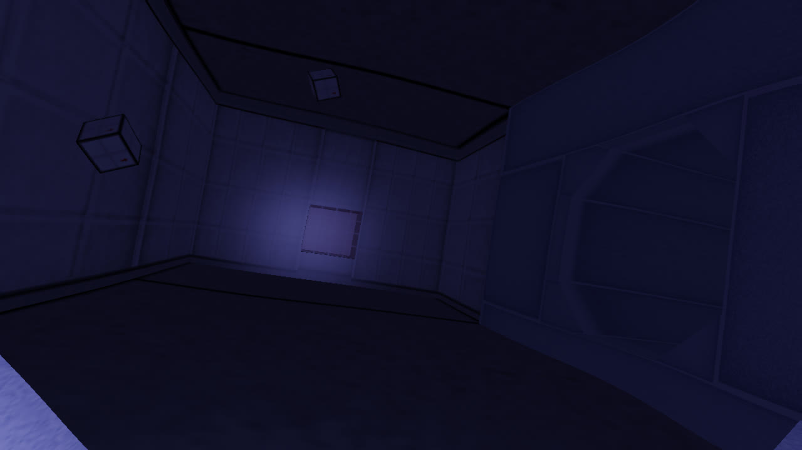

# COIIL

Author: Sebastien Alaiwan

<p align="center"></p>

Description
-----------

This is a demo of a platform-independent C++17 first-person exploration game.
It uses SDL2, and modern OpenGL.

Directory structure
-------------------

```
bin:            output directory for architecture-specific executable binaries.
res:            output directory for generated game resources (e.g. sounds, music, sprites, tilesets).
assets:         source files for game resources.
src:            source files for the game logic (agnostic to the engine implementation).
engine/src:     I/O code (=engine), mostly game-agnostic.
engine/include: interfaces for communication between the game logic and the I/O code. Also contains shared low-level utilities (e.g Vector2f, Span, etc.).
./check:        main check script. Call this to build linux+windows versions and to launch the unit tests.
```

Asset conditioning
------------------

To generate the game data from the committed asset files, you will need:
```
* ffmpeg
* gimp
* blender
```

Build
-----

Requirements:
```
* libsdl2-dev
```

It can be compiled to native code using your native compiler (gcc or clang):

```
$ make
```

The binaries will be generated to a 'bin' directory
(This can be overriden using the BIN makefile variable).

Run the game
------------

```
$ bin/rel/game.exe
```

